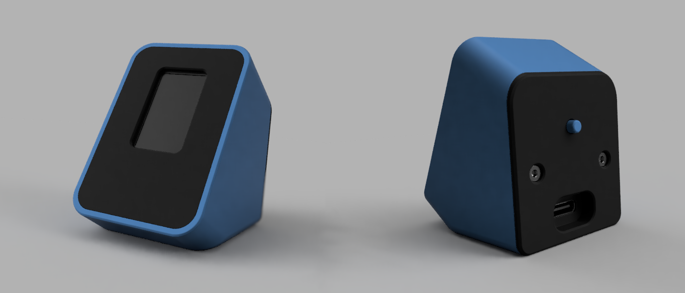

# Getting started with device32

[](https://github.com/unixvoid/device32/actions/workflows/build.yml)
[](https://github.com/unixvoid/device32/blob/main/LICENSE)

This repository contains PlatformIO example projects and documentation for device32, an ESP32-based device with OLED display and select button on the back.

## Quick links
- [full_demo](https://github.com/unixvoid/device32/tree/main/examples/full_demo) — Code that is shipped on device, also documentation on controls/features
- [examples/](https://github.com/unixvoid/device32/tree/main/examples/) — PlatformIO projects with individual READMEs
- [docs/](https://github.com/unixvoid/device32/tree/main/docs/) — hardware, wiring, BOM, and enclosure notes

## Getting started
Getting started with device32 is a straightforward process, we need to set up our IDE(VSCode) with the PlatformIO extension, clone down the repository, and then flash the device.
1. **Install Visual Studio Code (VSCode)**: Download and install VSCode from [https://code.visualstudio.com/](https://code.visualstudio.com/) if you haven't already.
2. **Install Prerequisites**:
   - Ensure Python 3.6+ is installed (PlatformIO requires it). Download from [https://www.python.org/](https://www.python.org/) if needed.
3. **Clone the Repository**:
   ```
   git clone https://github.com/unixvoid/device32.git
   ```
4. **Pick an Example**: Choose one of the examples in `examples/` and open that directory in VSCode, for example if I wanted to load "morph" I would open `device32/examples/morph/` in VSCode
5. **Install the PlatformIO Extension**: Once VSCode is open with the intended example, go to the Extensions view (Ctrl+Shift+X), search for "PlatformIO IDE", and install it. This extension provides the PlatformIO interface within VSCode.
6. **Run an Example**:
   - Connect your device32 via USB and select the correct serial port in PlatformIO.
   - Use the PlatformIO toolbar in VSCode to build (hammer icon) and flash (arrow icon) the project to your device32.
7. **Additional Notes**:
   - Check the `docs/` folder for hardware setup, wiring, and BOM details.
   - If an example lacks a README, refer to the main repo README or PlatformIO docs for general ESP32 flashing guidance.
   - For issues, ensure your device32 is powered on and connected, and check the PlatformIO logs in VSCode's terminal.

## Online Demo

There's an online demo available on Wokwi that simulates the full device32 hardware, allowing you to write and test code without physical hardware. Note that in the Wokwi demo, the screen is rotated 90 degrees clockwise compared to the actual device. Also the physical device32 runs code much faster than the Wokwi simulator, but its good for getting started.

[Try the demo on Wokwi](https://wokwi.com/projects/450965011609303041)

## Hardware Specs
- MPU: Seed Xiao ESP32C3
- Display: SSD1306/SSD1315 OLED
- Button: Normally Open
- Power-in/Flash: USB-C

### Hardware Assignment
- D5/GPIO3 -> Button
- D6/GPIO4 -> OLED SCL
- D7/GPIO5 -> OLED SDA

### Contributions
See CONTRIBUTING.md for contribution guidelines and example creation guidance.

### License
This repo is licensed under the MIT License — see LICENSE.