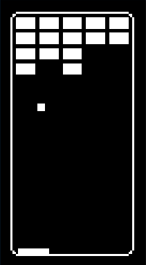

# Brick Break

Brick Break is a breakout game demo. The AI does not match the balls moves 1 for 1 but instead shows a little lag between inputs. The computer wins most of the time but not all of the time.

## Requirements
- device32 hardware (ESP32-based with OLED display)
- PlatformIO development environment
- USB connection for flashing

## Setup
1. Open this folder (`examples/brick_break/`) in VSCode with PlatformIO installed.
2. Connect your device32 via USB.
3. Use PlatformIO to build and flash the project.

## Usage
The game runs automatically with AI controlling the paddle. Watch as the AI attempts to break all the bricks by bouncing the ball off the paddle.

## Controls
- No user controls; the game is fully automated.

## Notes
- The display is rotated 90 degrees for vertical orientation.
- The game resets automatically after winning or losing.