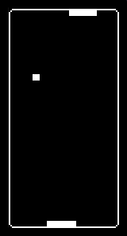

# Pong

This is a simple pong simulation where 2 computer players play against each other forever.

## Requirements
- device32 hardware (ESP32-based with OLED display)
- PlatformIO development environment
- USB connection for flashing

## Setup
1. Open this folder (`examples/pong/`) in VSCode with PlatformIO installed.
2. Connect your device32 via USB.
3. Use PlatformIO to build and flash the project.

## Usage
Two AI-controlled paddles play an endless game of Pong on the OLED screen.

## Controls
- No user controls; the game is fully automated.

## Notes
- The ball resets to the center when it goes off-screen.
- Paddles move to track the ball with simple AI.