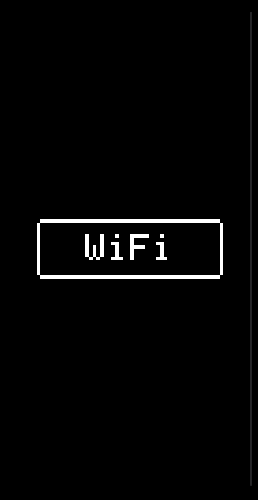

# Weather Display App
  
This is a real-time weather and time display app for the device32 (ESP32-based board with OLED display). It shows current weather conditions and local time.

## Requirements
- device32 hardware (ESP32-based with OLED display)
- PlatformIO development environment
- USB connection for flashing
- WiFi network for internet access

## Configuration
Edit the constants at the top of `src/main.cpp` to customize:

- **WiFi Credentials**:
  ```cpp
  const char* ssid = "your_wifi_ssid";
  const char* pass = "your_wifi_password";
  ```

- **Location**:
  ```cpp
  const float latitude = 41.2565;
  const float longitude = -95.9345;
  ```

## Setup
1. Open this folder (`examples/weather/`) in VSCode with PlatformIO installed.
2. Update the WiFi SSID and password in `src/main.cpp`.
3. Connect your device32 via USB.
4. Use PlatformIO to build and upload the project (`pio run --target upload`).

## Usage
- Power on the device—it will connect to WiFi, detect timezone, and start displaying weather and time.
- The display shows:
  - Weather label and description (e.g., "Clear sky")
  - Temperature in Fahrenheit (e.g., "45 F")
  - Time in HH:MM format (e.g., "13:03")
- No user controls needed; it's fully automatic.

## Notes
- Weather data is fetched from Open-Meteo (free, open-source).
- Timezone is auto-detected via IP geolocation; ensure your network allows outbound HTTP requests.
- If weather fails to load, check WiFi connection and serial output for errors.
- Power consumption is low; suitable for continuous operation.