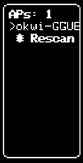

# WiFi Scanner App



This is a WiFi scanner app for the device32 (ESP32-based board with OLED display). It scans and displays nearby WiFi access points with their details.

## Requirements
- device32 hardware
- PlatformIO development environment
- USB connection for flashing

## Configuration
Edit the constants in `src/config.h` to customize pin assignments if needed:

- **OLED Display Pins**:
  ```cpp
  #define OLED_SDA 21
  #define OLED_SCL 22
  #define OLED_RST -1
  #define OLED_ADDR 0x3C
  ```

- **Button Pin**:
  ```cpp
  #define BUTTON_PIN 0
  ```

## Setup
1. Open this folder (`examples/wifi_scanner/`) in VSCode with PlatformIO installed.
2. Connect your device32 via USB.
3. Use PlatformIO to build and upload the project (`pio run --target upload`).

## Usage
- Power on the device—it will scan for nearby WiFi access points and display them.
- The display shows a list of access points with their SSIDs.
- Use the button for navigation:
  - **Short press**: Move to next item in list or next detail field.
  - **Long press**: Enter detail view for selected AP or return to list.
- In list view, select "Rescan" at the bottom to refresh the AP list (shows "Scanning.." during scan).
- In detail view, navigate through fields: SSID, BSSID, RSSI, Channel, Encryption.
- Long SSIDs/BSSIDs scroll horizontally when selected.